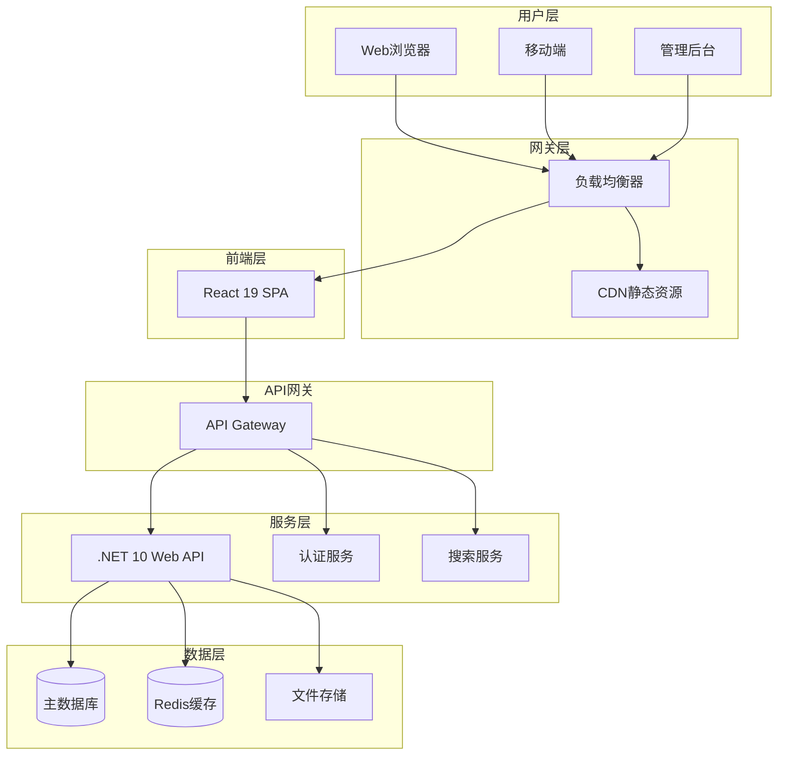
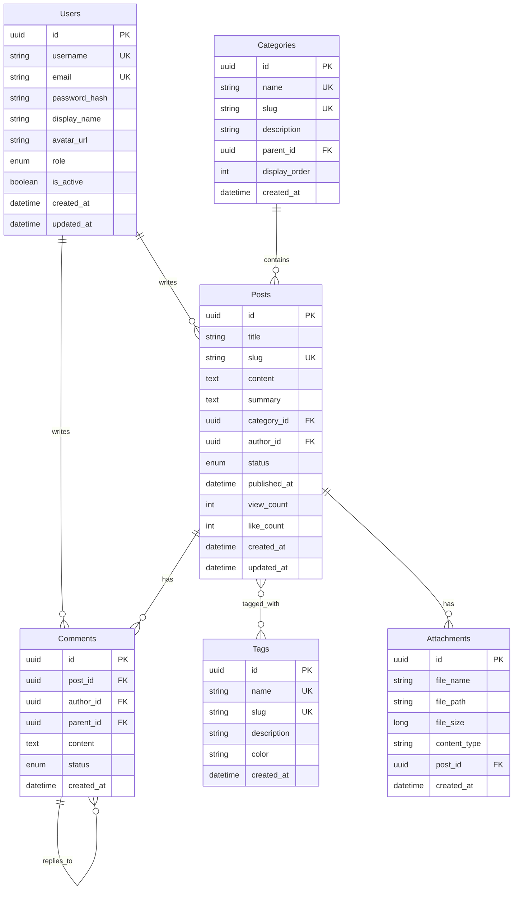
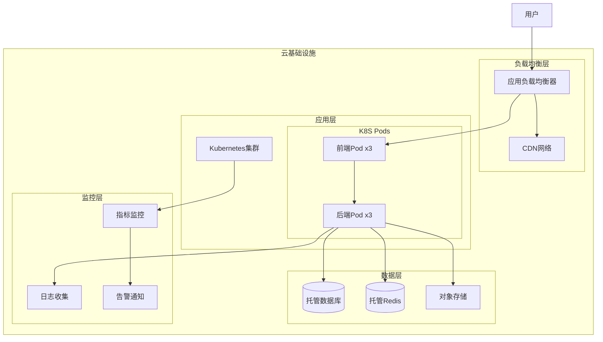

# 🏗️ Maple Blog 技术架构文档

## 📋 目录

1. [架构概述](#架构概述)
2. [技术选型](#技术选型)
3. [系统架构](#系统架构)
4. [数据库设计](#数据库设计)
5. [API设计](#api设计)
6. [前端架构](#前端架构)
7. [后端架构](#后端架构)
8. [部署架构](#部署架构)
9. [安全架构](#安全架构)
10. [性能优化](#性能优化)

---

## 🎯 架构概述

Maple Blog采用现代化的前后端分离架构，具备高可扩展性、高性能和高可维护性。系统基于微服务思想设计，支持水平扩展和云原生部署。

### 设计原则

- **单一职责原则** - 每个模块专注特定功能
- **开闭原则** - 对扩展开放，对修改封闭
- **依赖倒置原则** - 依赖抽象而非具体实现
- **接口隔离原则** - 使用专门的接口
- **领域驱动设计** - 以业务领域为核心

---

## 🛠️ 技术选型

### 前端技术栈

| 技术 | 版本 | 用途 | 选择理由 |
|------|------|------|----------|
| **React** | 19.x | 核心框架 | 最新特性、React Compiler自动优化 |
| **TypeScript** | 5.x | 类型系统 | 类型安全、开发效率 |
| **Vite** | 5.x | 构建工具 | 快速构建、HMR |
| **Zustand** | 4.x | 状态管理 | 轻量级、TypeScript友好 |
| **TanStack Query** | 5.x | 服务端状态 | 缓存、同步、错误处理 |
| **React Router** | 6.x | 路由管理 | 声明式路由 |
| **Tailwind CSS** | 3.x | 样式框架 | 实用优先、响应式 |
| **React Hook Form** | 7.x | 表单处理 | 性能优异、验证简单 |
| **Framer Motion** | 11.x | 动画库 | 流畅动画、手势支持 |

### 后端技术栈

| 技术 | 版本 | 用途 | 选择理由 |
|------|------|------|----------|
| **.NET** | 10.x | 核心框架 | 高性能、跨平台 |
| **ASP.NET Core** | 10.x | Web框架 | RESTful API、中间件 |
| **Entity Framework Core** | 9.x | ORM | Code First、多数据库 |
| **AutoMapper** | 13.x | 对象映射 | 简化DTO转换 |
| **FluentValidation** | 11.x | 数据验证 | 链式验证、可测试 |
| **JWT Bearer** | 7.x | 身份认证 | 无状态、可扩展 |
| **Serilog** | 3.x | 日志记录 | 结构化日志、多输出 |
| **Swagger** | 6.x | API文档 | 自动生成、交互式 |

### 数据库支持

| 数据库 | 用途 | 特点 |
|--------|------|------|
| **SQLite** | 开发环境 | 零配置、文件数据库 |
| **PostgreSQL** | 生产环境(推荐) | 高性能、JSON支持、扩展性强 |
| **SQL Server** | 企业环境 | 微软生态、高可用 |
| **MySQL** | 通用选择 | 广泛使用、社区支持 |
| **Oracle** | 大型企业 | 高端功能、稳定性 |

---

## 🏛️ 系统架构

### 整体架构图



### 分层架构

```
┌─────────────────────────────────────────────┐
│                表示层 (Presentation)         │
│  React Components, Pages, UI Logic         │
├─────────────────────────────────────────────┤
│                应用层 (Application)          │
│  API Controllers, DTOs, Validation         │
├─────────────────────────────────────────────┤
│                业务层 (Domain)               │
│  Entities, Value Objects, Domain Logic     │
├─────────────────────────────────────────────┤
│              基础设施层 (Infrastructure)      │
│  Data Access, External Services, Cache     │
└─────────────────────────────────────────────┘
```

---

## 🗄️ 数据库设计

### 核心实体关系图



### 数据库配置策略

```csharp
// 多数据库提供程序接口
public interface IDbConnectionFactory
{
    void ConfigureDbContext(DbContextOptionsBuilder options, string connectionString);
    string GetConnectionString(IConfiguration configuration);
    bool SupportsMigrations { get; }
}

// 数据库配置示例
public class DatabaseConfiguration
{
    public string Provider { get; set; } = "SQLite";
    public Dictionary<string, string> ConnectionStrings { get; set; } = new();
}
```

---

## 🔗 API设计

### RESTful API 规范

| 资源 | 方法 | 端点 | 描述 |
|------|------|------|------|
| 文章 | GET | `/api/posts` | 获取文章列表 |
| 文章 | GET | `/api/posts/{id}` | 获取文章详情 |
| 文章 | POST | `/api/posts` | 创建文章 |
| 文章 | PUT | `/api/posts/{id}` | 更新文章 |
| 文章 | DELETE | `/api/posts/{id}` | 删除文章 |
| 分类 | GET | `/api/categories` | 获取分类列表 |
| 标签 | GET | `/api/tags` | 获取标签列表 |
| 评论 | GET | `/api/posts/{id}/comments` | 获取文章评论 |
| 用户 | POST | `/api/auth/login` | 用户登录 |
| 用户 | POST | `/api/auth/register` | 用户注册 |

### API响应格式

```json
{
  "success": true,
  "data": {
    "id": "uuid",
    "title": "文章标题",
    "content": "文章内容"
  },
  "message": "操作成功",
  "timestamp": "2024-01-01T00:00:00Z"
}
```

### 错误处理

```json
{
  "success": false,
  "error": {
    "code": "VALIDATION_ERROR",
    "message": "数据验证失败",
    "details": [
      {
        "field": "title",
        "message": "标题不能为空"
      }
    ]
  },
  "timestamp": "2024-01-01T00:00:00Z"
}
```

---

## ⚛️ 前端架构

### 组件层次结构

```
App
├── Router
│   ├── PublicRoutes
│   │   ├── HomePage
│   │   ├── BlogListPage
│   │   ├── BlogDetailPage
│   │   └── ArchivePage
│   ├── AuthRoutes
│   │   ├── LoginPage
│   │   └── RegisterPage
│   └── ProtectedRoutes
│       ├── AdminDashboard
│       ├── PostEditor
│       └── UserProfile
├── Layout
│   ├── Header
│   ├── Navigation
│   ├── Sidebar
│   └── Footer
└── GlobalProviders
    ├── ThemeProvider
    ├── AuthProvider
    └── QueryClient
```

### 状态管理策略

```typescript
// Zustand Store 示例
interface BlogStore {
  posts: Post[];
  currentPost: Post | null;
  loading: boolean;
  error: string | null;

  // Actions
  fetchPosts: () => Promise<void>;
  fetchPost: (id: string) => Promise<void>;
  createPost: (post: CreatePostRequest) => Promise<void>;
  updatePost: (id: string, post: UpdatePostRequest) => Promise<void>;
  deletePost: (id: string) => Promise<void>;
}

// TanStack Query 钩子
const usePosts = (params: PostQueryParams) => {
  return useQuery({
    queryKey: ['posts', params],
    queryFn: () => blogApi.getPosts(params),
    staleTime: 5 * 60 * 1000, // 5分钟
  });
};
```

### 路由设计

```typescript
const router = createBrowserRouter([
  {
    path: "/",
    element: <Layout />,
    children: [
      { index: true, element: <HomePage /> },
      { path: "blog", element: <BlogListPage /> },
      { path: "blog/:slug", element: <BlogDetailPage /> },
      { path: "archive", element: <ArchivePage /> },
      { path: "about", element: <AboutPage /> },
    ],
  },
  {
    path: "/auth",
    element: <AuthLayout />,
    children: [
      { path: "login", element: <LoginPage /> },
      { path: "register", element: <RegisterPage /> },
    ],
  },
  {
    path: "/admin",
    element: <ProtectedRoute><AdminLayout /></ProtectedRoute>,
    children: [
      { index: true, element: <AdminDashboard /> },
      { path: "posts", element: <PostManagement /> },
      { path: "posts/new", element: <PostEditor /> },
      { path: "posts/:id/edit", element: <PostEditor /> },
    ],
  },
]);
```

---

## 🏗️ 后端架构

### Clean Architecture 实现

```
MapleBlog.Domain/
├── Entities/           # 领域实体
│   ├── User.cs
│   ├── Post.cs
│   ├── Category.cs
│   └── Comment.cs
├── ValueObjects/       # 值对象
├── Interfaces/         # 领域接口
└── Enums/             # 枚举

MapleBlog.Application/
├── Services/          # 应用服务
├── DTOs/             # 数据传输对象
├── Mappings/         # AutoMapper配置
├── Validators/       # FluentValidation验证器
└── Interfaces/       # 应用接口

MapleBlog.Infrastructure/
├── Data/             # EF Core配置
├── Repositories/     # 仓储实现
└── Services/         # 外部服务实现

MapleBlog.API/
├── Controllers/      # API控制器
├── Middleware/       # 自定义中间件
└── Configuration/    # 启动配置
```

### 依赖注入配置

```csharp
// Program.cs
var builder = WebApplication.CreateBuilder(args);

// 数据库配置
builder.Services.AddDbContext<BlogDbContext>((serviceProvider, options) =>
{
    var factory = serviceProvider.GetRequiredService<IDbConnectionFactory>();
    var connectionString = factory.GetConnectionString(builder.Configuration);
    factory.ConfigureDbContext(options, connectionString);
});

// 仓储和服务注册
builder.Services.AddScoped<IPostRepository, PostRepository>();
builder.Services.AddScoped<IPostService, PostService>();

// 认证配置
builder.Services.AddAuthentication(JwtBearerDefaults.AuthenticationScheme)
    .AddJwtBearer(options => {
        // JWT配置
    });

// AutoMapper
builder.Services.AddAutoMapper(typeof(MappingProfile));

// FluentValidation
builder.Services.AddValidatorsFromAssemblyContaining<CreatePostValidator>();
```

---

## 🚀 部署架构

### 容器化部署

```yaml
# docker-compose.yml
version: '3.8'
services:
  # 前端应用
  frontend:
    build:
      context: ./frontend
      dockerfile: Dockerfile
    ports:
      - "3000:80"
    environment:
      - REACT_APP_API_URL=http://localhost:5000

  # 后端API
  backend:
    build:
      context: ./backend
      dockerfile: Dockerfile
    ports:
      - "5000:80"
    environment:
      - ASPNETCORE_ENVIRONMENT=Production
      - Database__Provider=PostgreSQL
      - Database__ConnectionStrings__PostgreSQL=${POSTGRES_CONNECTION}
    depends_on:
      - postgres
      - redis

  # 数据库
  postgres:
    image: postgres:15
    environment:
      POSTGRES_DB: maple_blog
      POSTGRES_USER: ${POSTGRES_USER}
      POSTGRES_PASSWORD: ${POSTGRES_PASSWORD}
    volumes:
      - postgres_data:/var/lib/postgresql/data

  # 缓存
  redis:
    image: redis:7-alpine
    volumes:
      - redis_data:/data

volumes:
  postgres_data:
  redis_data:
```

### 云部署架构



---

## 🔒 安全架构

### 认证和授权

```csharp
// JWT配置
services.AddAuthentication(JwtBearerDefaults.AuthenticationScheme)
    .AddJwtBearer(options =>
    {
        options.TokenValidationParameters = new TokenValidationParameters
        {
            ValidateIssuer = true,
            ValidateAudience = true,
            ValidateLifetime = true,
            ValidateIssuerSigningKey = true,
            ValidIssuer = configuration["Jwt:Issuer"],
            ValidAudience = configuration["Jwt:Audience"],
            IssuerSigningKey = new SymmetricSecurityKey(
                Encoding.UTF8.GetBytes(configuration["Jwt:SecretKey"]))
        };
    });

// 授权策略
services.AddAuthorization(options =>
{
    options.AddPolicy("RequireAdminRole", policy =>
        policy.RequireRole("Admin"));
    options.AddPolicy("RequireAuthorOrAdmin", policy =>
        policy.Requirements.Add(new AuthorOrAdminRequirement()));
});
```

### 数据保护

- **密码加密** - BCrypt哈希
- **数据传输** - HTTPS/TLS
- **SQL注入防护** - 参数化查询
- **XSS防护** - 输入验证和输出编码
- **CSRF防护** - Anti-Forgery Token

---

## ⚡ 性能优化

### 缓存策略

```csharp
// Redis缓存配置
services.AddStackExchangeRedisCache(options =>
{
    options.Configuration = configuration.GetConnectionString("Redis");
});

// 缓存使用示例
public async Task<Post> GetPostAsync(Guid id)
{
    var cacheKey = $"post:{id}";
    var cachedPost = await _cache.GetStringAsync(cacheKey);

    if (cachedPost != null)
    {
        return JsonSerializer.Deserialize<Post>(cachedPost);
    }

    var post = await _repository.GetByIdAsync(id);

    if (post != null)
    {
        var serializedPost = JsonSerializer.Serialize(post);
        await _cache.SetStringAsync(cacheKey, serializedPost, TimeSpan.FromMinutes(10));
    }

    return post;
}
```

### 前端性能优化

- **代码分割** - React.lazy() + Suspense
- **虚拟滚动** - 长列表优化
- **图片懒加载** - Intersection Observer
- **缓存策略** - TanStack Query
- **Bundle优化** - Vite构建优化

### 数据库优化

- **索引优化** - 关键字段建索引
- **查询优化** - 避免N+1查询
- **连接池** - 数据库连接复用
- **读写分离** - 主从数据库
- **分页查询** - 避免全表扫描

---

## 📊 监控和日志

### 日志架构

```csharp
// Serilog配置
Log.Logger = new LoggerConfiguration()
    .MinimumLevel.Information()
    .MinimumLevel.Override("Microsoft", LogEventLevel.Warning)
    .Enrich.FromLogContext()
    .WriteTo.Console()
    .WriteTo.File("logs/app-.txt", rollingInterval: RollingInterval.Day)
    .WriteTo.Elasticsearch(new ElasticsearchSinkOptions(new Uri("http://localhost:9200")))
    .CreateLogger();
```

### 性能监控

- **应用性能监控** - Application Insights
- **基础设施监控** - Prometheus + Grafana
- **错误跟踪** - Sentry
- **用户行为分析** - Google Analytics

---

这份技术架构文档为 Maple Blog 项目提供了全面的技术指导，涵盖了从系统设计到部署运维的各个方面。文档将随着项目发展持续更新和完善。